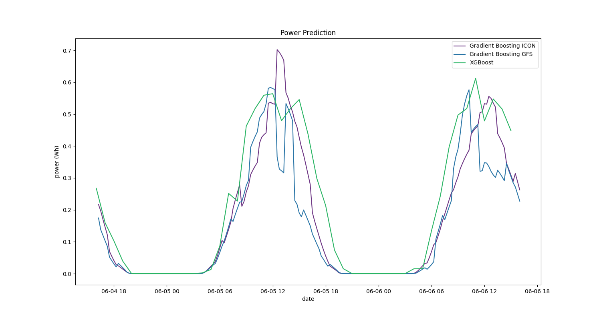
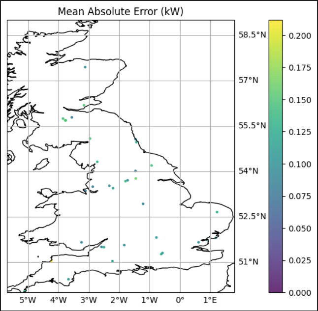

# Quartz Solar Forecast

<!-- ALL-CONTRIBUTORS-BADGE:START - Do not remove or modify this section -->
[](#contributors-)
<!-- ALL-CONTRIBUTORS-BADGE:END -->

The aim of the project is to build an open source PV forecast that is free and easy to use.
The forecast provides the expected generation in `kw` for 0 to 48 hours for a single PV site.

Open Climate Fix also provides a commercial PV forecast, please get in touch at quartz.support@openclimatefix.org

We recently presented the Quartz Solar Forecast project at FOSDEM 2024 (Free and Open source Software Developers' European Meeting), providing an introduction to Open Climate Fix's motivation for this project and its impact on aiding organizations in resource optimization. To learn more about predictive model's functionality, visit here: [Video Recording](https://www.youtube.com/watch?v=NAZ2VeiN1N8)

The current model uses GFS or ICON NWPs to predict the solar generation at a site

```python
from quartz_solar_forecast.forecast import run_forecast
from quartz_solar_forecast.pydantic_models import PVSite
from datetime import datetime

# make a pv site object
site = PVSite(latitude=51.75, longitude=-1.25, capacity_kwp=1.25)

# run model for today, using ICON NWP data
predictions_df = run_forecast(site=site, ts=datetime.today(), nwp_source="icon")
```

which should result in a time series similar to this one:


A colab notebook providing some examples can be found [here](https://colab.research.google.com/drive/1qKDFRpq4Hk-LHgWuDsz_Najc3Zq-GVNY?usp=sharing).

## Generating Forecasts

To generate solar forecasts and save them into a CSV file, follow these steps:

1. Navigate to the scripts directory

```bash
cd scripts
```

2. Run the forecast_csv.py script with desired inputs

```bash
python forecast_csv.py
```

Replace the --init_time_freq, --start_datetime, --end_datetime, and --site_name with your desired forecast initialization frequency (in hours), start datetime, end datetime, and the name of the forecast or site, respectively.

Output

The script will generate solar forecasts at the specified intervals between the start and end datetimes. The results will be combined into a CSV file named using the site name, start and end datetimes, and the frequency of forecasts. This file will be saved in the scripts/csv_forecasts directory.

## Installation

The source code is currently hosted on GitHub at: https://github.com/openclimatefix/Open-Source-Quartz-Solar-Forecast

Binary installers for the latest released version are available at the Python Package Index (PyPI)

```bash
pip install quartz-solar-forecast
```

You might need to install the following packages first

```bash
conda install -c conda-forge pyresample
```

This can solve the [bug: \_\_\_kmpc_for_static_fini](https://github.com/openclimatefix/Open-Source-Quartz-Solar-Forecast/issues/32).

## Model

Two models are currently available to make predictions.

**Gradient Boosting Model** (default)

The model uses GFS or ICON NWPs to predict the solar generation at a site.
It is a gradient boosted tree model and uses 9 NWP variables.
It is trained on 25,000 PV sites with over 5 years of PV history, which is available [here](https://huggingface.co/datasets/openclimatefix/uk_pv).
The training of this model is handled in [pv-site-prediction](https://github.com/openclimatefix/pv-site-prediction)
TODO - we need to benchmark this forecast.

The 9 NWP variables, from Open-Meteo documentation, are mentioned above with their appropariate units.

1. **Visibility (km)**, or vis: Distance at which objects can be clearly seen. Can affect the amount of sunlight reaching solar panels.
2. **Wind Speed at 10 meters (km/h)**, or si10 : Wind speed measured at a height of 10 meters above ground level. Important for understanding weather conditions and potential impacts on solar panels.
3. **Temperature at 2 meters (°C)**, or t : Air temperature measure at 2 meters above the ground. Can affect the efficiency of PV systems.
4. **Precipitation (mm)**, or prate : Precipitation (rain, snow, sleet, etc.). Helps to predict cloud cover and potentiel reductions in solar irradiance.
5. **Shortwave Radiation (W/m²)**, or dswrf: Solar radiation in the shortwave spectrum reaching the Earth's surface. Measure of the potential solar energy available for PV systems.
6. **Direct Radiation (W/m²)** or dlwrf: Longwave (infrared) radiation emitted by the Earth back into the atmosphere. **confirm it is correct**
7. **Cloud Cover low (%)**, or lcc: Percentage of the sky covered by clouds at low altitudes. Impacts the amount of solar radiation reachign the ground, and similarly the PV system.
8. **Cloud Cover mid (%)**, or mcc : Percentage of the sky covered by clouds at mid altitudes.
9. **Cloud Cover high (%)**, or lcc : Percentage of the sky covered by clouds at high altitude
   We also use the following features

- poa_global: The plane of array irradiance, which is the amount of solar radiation that strikes a solar panel.
- poa_global_now_is_zero: A boolean variable that is true if the poa_global is zero at the current time. This is used to help the model learn that the PV generation is zero at night.
- capacity (kw): The capacity of the PV system in kw.
- The model also has a feature to check if these variables are NaNs or not.
  The model also uses the following variables, which are currently all set to nan
- recent_power: The mean power over the last 30 minutes
- h_mean: The mean of the recent pv data over the last 7 days
- h_median: The median of the recent pv data over the last 7 days
- h_max: The max of the recent pv data over the last 7 days

**XGBoost**

The second option is an XGBoost model and uses the following Numerical Weather Predictions (NWP) input features achieved from [open-meteo](https://open-meteo.com/) variables. Different types of data is provided by open-meteo. To train this model hourly forecast data of [the historical weather API](https://open-meteo.com/en/docs/historical-weather-api) was used. The time period is restricted by the availabilty of the target solar enegery data of the panels and covers the time between 2018 and 2021. Additional information about the time, location and specifics about the panel are used. The weather features used are listed below, with the description given by open-meteo.

- Temperature at 2m (ºC): Air temperature at 2 meters above ground
- Relative Humidity at 2m (%): Relative humidity at 2 meters above ground
- Dewpoint at 2m (ºC): Dew point temperature at 2 meters above ground
- Precipitation (rain + snow) (mm): Total precipitation (rain, showers, snow) sum of the preceding hour
- Surface Pressure (hPa): Atmospheric air pressure reduced to mean sea level (msl) or pressure at surface. Typically pressure on mean sea level is used in meteorology. Surface pressure gets lower with increasing elevation.
- Cloud Cover Total (%): Total cloud cover as an area fraction
- Cloud Cover Low (%): Low level clouds and fog up to 3 km altitude
- Cloud Cover Mid (%): Mid level clouds from 3 to 8 km altitude
- Cloud Cover High (%): High level clouds from 8 km altitude
- Wind Speed at 10m (km/h): Wind speed at 10, 80, 120 or 180 meters above ground. Wind speed on 10 meters is the standard level.
- Wind Direction (10m): Wind direction at 10 meters above ground
- Is day or Night: 1 if the current time step has daylight, 0 at night
- Direct Solar Radiation (W/m2): Direct solar radiation as average of the preceding hour on the horizontal plane and the normal plane (perpendicular to the sun)
- Diffusive Solar Radiation DHI (W/m2): Diffuse solar radiation as average of the preceding hour

To use this model specify `model="xgb"` in `run_forecast(site=site, model="xgb", ts=datetime.today())`.

## Model Comparisons

The following plot shows example predictions of both models for the same time period. Additionally for the Gradient Boosting model (default) the results from the two different data sources are shown.


_Predictions using the two different models and different data sources._

## Known restrictions

- The model is trained on [UK MetOffice](https://www.metoffice.gov.uk/services/data/met-office-weather-datahub) NWPs, but when running inference we use [GFS](https://www.ncei.noaa.gov/products/weather-climate-models/global-forecast) data from [Open-meteo](https://open-meteo.com/). The differences between GFS and UK MetOffice could led to some odd behaviours.
- Depending, whether the timestamp for the prediction lays more than 90 days in the past or not, different data sources for the NWP are used. If we predict within the last 90 days, we can use ICON or GFS from the open-meteo Weather Forecast API. Since ICON doesn't provide visibility, this parameter is queried from GFS in any case. If the date for the prediction is further back in time, a reanalysis model of historical data is used (open-meteo | Historical Weather API). The historical weather API doesn't't provide visibility at all, that's why it's set to a maximum of 24000 meter in this case. This can lead to some loss of precision.
- The model was trained and tested only over the UK, applying it to other geographical regions should be done with caution.
- When using the XGBoost model, only hourly predictions within the last 90 days are available for data consistency.

## Evaluation

**Gradient Boosting Model** (default)

To evaluate the model we use the [UK PV](https://huggingface.co/datasets/openclimatefix/uk_pv) dataset and the [ICON NWP](https://huggingface.co/datasets/openclimatefix/dwd-icon-eu) dataset.
All the data is publicly available and the evaluation script can be run with the following command

```bash
python scripts/run_evaluation.py
```

The test dataset we used is defined in `quartz_solar_forecast/dataset/testset.csv`.
This contains 50 PV sites, which 50 unique timestamps. The data is from 2021.

The results of the evaluation are as follows The MAE is 0.1906 kw across all horizons.

| Horizons | MAE [kw]      | MAE [%] |
| -------- | ------------- | ------- |
| 0        | 0.202 +- 0.03 | 6.2     |
| 1        | 0.211 +- 0.03 | 6.4     |
| 2        | 0.216 +- 0.03 | 6.5     |
| 3 - 4    | 0.211 +- 0.02 | 6.3     |
| 5 - 8    | 0.191 +- 0.01 | 6       |
| 9 - 16   | 0.161 +- 0.01 | 5       |
| 17 - 24  | 0.173 +- 0.01 | 5.3     |
| 24 - 48  | 0.201 +- 0.01 | 6.1     |

If we exclude nighttime, then the average MAE [%] from 0 to 36 forecast hours is 13.0%.

Notes:

- The MAE in % is the MAE divided by the capacity of the PV site. We acknowledge there are a number of different ways to do this.
- It is slightly surprising that the 0-hour forecast horizon and the 24-48 hour horizon have a similar MAE.
  This may be because the model is trained expecting live PV data, but currently in this project we provide no live PV data.

**XGBoost**

The model was trained and evaluated on 1147 solar panels and tested on 37 independent locations. An intensive hyperparameter tuning was performed. The model provides a feature importance list. Different metrics were calculated and analyzed. Finally the model was evaluated using the Mean Absolute Error (MAE). The MAE over the entire test data is $0.12$ kW, when the night times are excluded the MAE is $0.21$ kW. A plot with the MAE for each panel in the test set is shown in the figure below.


_Mean absolute error for the panels in the test set._

Notes:

- The evaluation per horizon is not available for this model, as it is not provided by the open-meteo data.

## Abbreviations

- NWP: Numerical Weather Predictions
- GFS: Global Forecast System
- PV: Photovoltaic
- MAE: Mean Absolute Error
- [ICON](https://www.dwd.de/EN/ourservices/nwp_forecast_data/nwp_forecast_data.html): ICOsahedral Nonhydrostatic
- KW: Kilowatt

## FOSDEM

FOSDEM is a free event for software developers to meet, share ideas and collaborate. Every year, thousands of developers of free and open source software from all over the world gather at the event in Brussels.
OCF presented Quartz Solar Forecast project at FOSDEM 2024. The link to the original FOSDEM video is availble at [Quartz Solar OS: Building an open source AI solar forecast for everyone](https://fosdem.org/2024/schedule/event/fosdem-2024-2960-quartz-solar-os-building-an-open-source-ai-solar-forecast-for-everyone/).
It is also available on [YouTube](https://www.youtube.com/watch?v=NAZ2VeiN1N8)

## Running the dashboard locally

Start the API first (port 8000):
`cd api`
`python main.py`

Start the frontend (port 5137):
`cd dashboards/dashboard_1`
`npm install`
`npm run dev`

There is also a steamlit dashboard in `dashboards/dashboard_2` that can be used. 

## Contribution

We welcome other models.

## Contributors ✨

Thanks goes to these wonderful people ([emoji key](https://allcontributors.org/docs/en/emoji-key)):

<!-- ALL-CONTRIBUTORS-LIST:START - Do not remove or modify this section -->
<!-- prettier-ignore-start -->
<!-- markdownlint-disable -->
<table>
  <tbody>
    <tr>
      <td align="center" valign="top" width="14.28%"><a href="https://github.com/peterdudfield"><br /><sub><b>Peter Dudfield</b></sub></a><br /><a href="https://github.com/openclimatefix/open-source-quartz-solar-forecast/commits?author=peterdudfield" title="Code">💻</a></td>
      <td align="center" valign="top" width="14.28%"><a href="https://github.com/zakwatts"><br /><sub><b>Megawattz</b></sub></a><br /><a href="#ideas-zakwatts" title="Ideas, Planning, & Feedback">🤔</a> <a href="#talk-zakwatts" title="Talks">📢</a></td>
      <td align="center" valign="top" width="14.28%"><a href="https://github.com/EdFage"><br /><sub><b>EdFage</b></sub></a><br /><a href="https://github.com/openclimatefix/open-source-quartz-solar-forecast/commits?author=EdFage" title="Documentation">📖</a> <a href="https://github.com/openclimatefix/open-source-quartz-solar-forecast/commits?author=EdFage" title="Code">💻</a></td>
      <td align="center" valign="top" width="14.28%"><a href="https://github.com/chloepilonv"><br /><sub><b>Chloe Pilon Vaillancourt</b></sub></a><br /><a href="https://github.com/openclimatefix/open-source-quartz-solar-forecast/commits?author=chloepilonv" title="Documentation">📖</a></td>
      <td align="center" valign="top" width="14.28%"><a href="http://racheltipton.dev"><br /><sub><b>rachel tipton</b></sub></a><br /><a href="#talk-rachel-labri-tipton" title="Talks">📢</a></td>
      <td align="center" valign="top" width="14.28%"><a href="https://github.com/armenbod"><br /><sub><b>armenbod</b></sub></a><br /><a href="#content-armenbod" title="Content">🖋</a> <a href="https://github.com/openclimatefix/open-source-quartz-solar-forecast/commits?author=armenbod" title="Code">💻</a></td>
      <td align="center" valign="top" width="14.28%"><a href="https://github.com/shreyasudaya"><br /><sub><b>Shreyas Udaya</b></sub></a><br /><a href="https://github.com/openclimatefix/open-source-quartz-solar-forecast/commits?author=shreyasudaya" title="Documentation">📖</a></td>
    </tr>
    <tr>
      <td align="center" valign="top" width="14.28%"><a href="http://github.com/aryanbhosale"><br /><sub><b>Aryan Bhosale</b></sub></a><br /><a href="https://github.com/openclimatefix/open-source-quartz-solar-forecast/commits?author=aryanbhosale" title="Documentation">📖</a> <a href="https://github.com/openclimatefix/open-source-quartz-solar-forecast/commits?author=aryanbhosale" title="Code">💻</a></td>
      <td align="center" valign="top" width="14.28%"><a href="https://github.com/0xFrama"><br /><sub><b>Francesco</b></sub></a><br /><a href="https://github.com/openclimatefix/open-source-quartz-solar-forecast/commits?author=0xFrama" title="Code">💻</a></td>
      <td align="center" valign="top" width="14.28%"><a href="https://github.com/roshnaeem"><br /><sub><b>Rosheen Naeem</b></sub></a><br /><a href="https://github.com/openclimatefix/open-source-quartz-solar-forecast/commits?author=roshnaeem" title="Documentation">📖</a></td>
      <td align="center" valign="top" width="14.28%"><a href="https://github.com/bikramb98"><br /><sub><b>Bikram Baruah</b></sub></a><br /><a href="https://github.com/openclimatefix/open-source-quartz-solar-forecast/commits?author=bikramb98" title="Code">💻</a></td>
      <td align="center" valign="top" width="14.28%"><a href="https://github.com/Hapyr"><br /><sub><b>Jakob Gebler</b></sub></a><br /><a href="https://github.com/openclimatefix/open-source-quartz-solar-forecast/issues?q=author%3AHapyr" title="Bug reports">🐛</a></td>
      <td align="center" valign="top" width="14.28%"><a href="https://github.com/ombhojane"><br /><sub><b>Om Bhojane</b></sub></a><br /><a href="https://github.com/openclimatefix/open-source-quartz-solar-forecast/commits?author=ombhojane" title="Code">💻</a></td>
      <td align="center" valign="top" width="14.28%"><a href="http://chrisadams.me.uk"><br /><sub><b>Chris Adams</b></sub></a><br /><a href="#ideas-mrchrisadams" title="Ideas, Planning, & Feedback">🤔</a></td>
    </tr>
    <tr>
      <td align="center" valign="top" width="14.28%"><a href="https://github.com/mudrap17"><br /><sub><b>Mudra Patel</b></sub></a><br /><a href="https://github.com/openclimatefix/open-source-quartz-solar-forecast/commits?author=mudrap17" title="Documentation">📖</a></td>
      <td align="center" valign="top" width="14.28%"><a href="https://github.com/diegomarvid"><br /><sub><b>Diego Marvid</b></sub></a><br /><a href="https://github.com/openclimatefix/open-source-quartz-solar-forecast/commits?author=diegomarvid" title="Documentation">📖</a></td>
      <td align="center" valign="top" width="14.28%"><a href="https://github.com/froukje"><br /><sub><b>Frauke Albrecht</b></sub></a><br /><a href="https://github.com/openclimatefix/open-source-quartz-solar-forecast/commits?author=froukje" title="Code">💻</a></td>
      <td align="center" valign="top" width="14.28%"><a href="https://github.com/Ludecan"><br /><sub><b>Pablo Alfaro</b></sub></a><br /><a href="https://github.com/openclimatefix/open-source-quartz-solar-forecast/pulls?q=is%3Apr+reviewed-by%3ALudecan" title="Reviewed Pull Requests">👀</a></td>
      <td align="center" valign="top" width="14.28%"><a href="https://github.com/KelRem"><br /><sub><b>KelRem</b></sub></a><br /><a href="#question-KelRem" title="Answering Questions">💬</a></td>
      <td align="center" valign="top" width="14.28%"><a href="https://github.com/sicunchen"><br /><sub><b>Lia Chen</b></sub></a><br /><a href="https://github.com/openclimatefix/open-source-quartz-solar-forecast/commits?author=sicunchen" title="Code">💻</a></td>
      <td align="center" valign="top" width="14.28%"><a href="https://clementlumumba.netlify.app/"><br /><sub><b>Clement Lumumba</b></sub></a><br /><a href="https://github.com/openclimatefix/open-source-quartz-solar-forecast/commits?author=Clemo97" title="Code">💻</a></td>
    </tr>
    <tr>
      <td align="center" valign="top" width="14.28%"><a href="https://github.com/aayushyatiwari"><br /><sub><b>aayush</b></sub></a><br /><a href="https://github.com/openclimatefix/open-source-quartz-solar-forecast/commits?author=aayushyatiwari" title="Documentation">📖</a></td>
      <td align="center" valign="top" width="14.28%"><a href="https://github.com/Brohan7524"><br /><sub><b>Rohan Singh</b></sub></a><br /><a href="https://github.com/openclimatefix/open-source-quartz-solar-forecast/commits?author=Brohan7524" title="Code">💻</a></td>
    </tr>
  </tbody>
</table>

<!-- markdownlint-restore -->
<!-- prettier-ignore-end -->

<!-- ALL-CONTRIBUTORS-LIST:END -->

This project follows the [all-contributors](https://github.com/all-contributors/all-contributors) specification. Contributions of any kind welcome!
