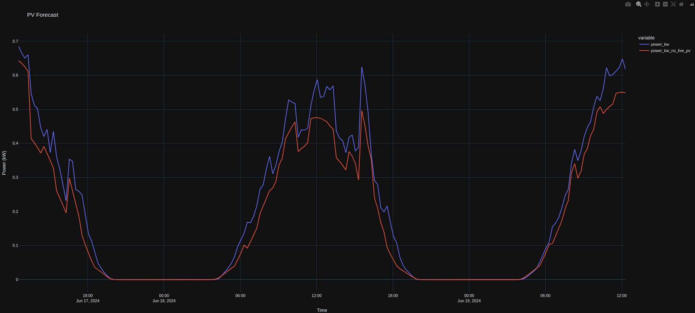
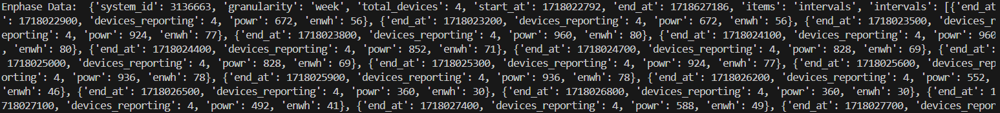
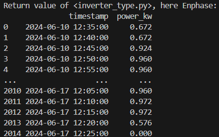

# Adding an Inverter to Quartz Solar Forecast

The aim of this module is to allow users to add their inverter brands to Quartz Solar Forecast and use live data instead of the default fake data.

Quartz Solar Forecast has support for Enphase inverters as of now, and we are working on increasing support for a wide range of solar inverters.

## Important Directories & Files

```markdown
Open-Source-Quartz-Solar-Forecast/
├── example/
│   └── inverter_example.py
├── quartz_solar_forecast/
│   ├── data.py
│   ├── pydantic_models.py
│   └── inverters/
├── tests/
│   └── data/
│       └── test_make_pv_data.py
```

## What each Directory holds

1. `example/`
   * `inverter_example.py`: Makes input data depending on the inverter type and compares it with the type with no data and runs the ML model along with a comparison plot using `plotly`. This is the file that you need to run in order to run the ML model. An example output with Enphase is demonstrated below:

     
2. `quartz_solar_forecast`:
   * `data.py`: Contains the `make_pv_data()` function, that conditionally checks the inverter type and constructs and `xarray` dataframe
   * `pydantic_models.py`: Contains the PVSite class
   * `inverters/`:
     * This is the directory where you'd want to create a new file among the other `<inverter_name>.py` files to add your inverter
     * You will need to follow the appropriate authentication flow as mentioned in the documentation of the inverter you're trying to add
     * We need the past 7 days data formatted in intervals of 5 minutes for this model. Given below is an example with Enphase

       
     * Once all the processing is done, make sure that your return type is of `pd.DataFrame` that has 2 colums, namely

       * `timestamp`: `timestamp=datetime.fromtimestamp(interval_end_time_in_unix_epochs, tz=timezone.utc).strftime('%Y-%m-%d %H:%M:%S')`, and then convert the timestamp column to `pd.to_datetime`
       * `power_kw`: Power in **KiloWatts.** An example is shown below with the formatted `pd.DataFrame`
         
3. `tests/`
   * `data/`
     * `test_make_pv_data.py`: Mocks the `make_pv_data()` function `data.py` file using various type of inverters and the `None` value too using `pytest`
       * Run this using `pytest tests/data/test_make_pv_data.py`

## How to Setup

1. Ensure you have a Linux Machine like Ubuntu or Kali installed
2. Navigate inside the `Open-Source-Quartz-Solar-Forecast` and create a `virtual environment` by entering `python -m venv venv`
3. Activate the `virtual environment` by entering `source venv/bin/activate`
4. Install the requirements by entering `pip install -r requirements.txt` and `pip install -e .`
5. Install `plotly` by entering `pip install plotly`
6. Create a `.env` file in the root directory, i.e. `Open-Source-Quartz-Solar-Forecast`
7. Add your Solar Inverter's user credentials along with environment variables in the `.env` file, refer to the `.env.example` file for Enphase & SolarEdge credential examples
8. Run the `inverter_example.py` file by entering `python examples/inverter_example.py`
